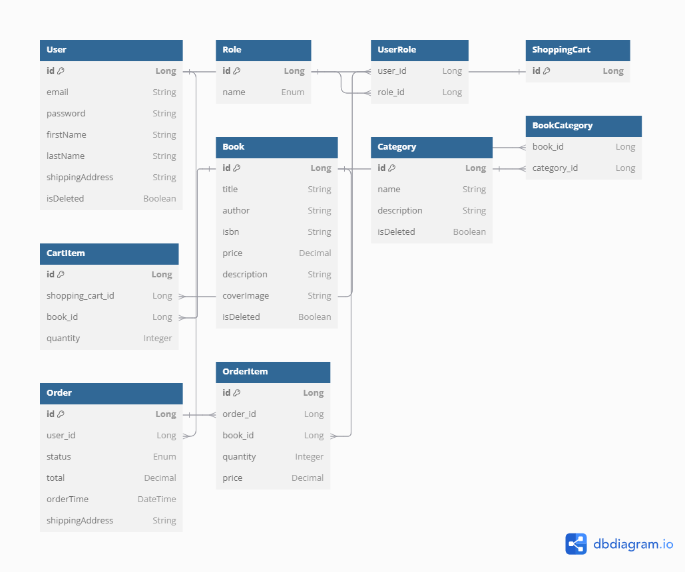

# 📚 Book Store Application

## 🌟 Introduction

The Book Store Application is a backend system designed to manage books, categories, users, and orders efficiently. It provides secure authentication, scalable design, and clean separation of concerns using modern Java development practices. This project was built to demonstrate skills in developing enterprise-grade applications with a focus on modularity, testability, and maintainability.

## 🛠️ Technologies and Tools
 
Java 17: Core programming language.

Spring Boot 3.2.5: Framework for WEB application development.

Spring Security 3.2.5: For authentication and authorization with Bearer tokens.

Spring Data JPA 3.2.5: For seamless database interactions using repositories.

MapStruct 1.5.5.Final: To map between entities and DTOs.

Liquibase 4.24.0: For database version control and migrations.

MySQL 8.3: Relational database for persistent storage.

Swagger/OpenAPI 2.1.0: For API documentation and testing.

Docker & Docker Compose 3.2.5: For containerization and deployment.

JUnit 4.13.2 & Mockito: For testing services, controllers, and repository layers.

## 🚀 Core Design Principles

This project is built on proven design patterns and technologies to ensure clean, scalable, and maintainable code.

### Approaches used:

**Services and their implementations**: All business logic is implemented in services that have well-defined interfaces (*ShoppingCartService*, *OrderService*, etc.). This allows for easy replacement or testing of individual components.

**JPA Repositories**: Both standard *JpaRepository* methods and custom JPQL/SQL queries are used for complex cases, for example:

    @Query("SELECT b FROM Book b JOIN b.categories c WHERE c.id = :categoryId AND b.isDeleted = false")
    List<Book> findAllByCategoryId(@Param("categoryId")Long categoryId);

**DTOs and Mappers**: DTOs are used to pass data between layers, and *MapStruct* is used to convert data. This ensures cleanliness and simplifies the code.

**Custom Exceptions**: The project defines its own exceptions, such as *EntityNotFoundException* and *OrderProcessingException*, to accurately describe problems.

**Global Exception Handler**: *CustomGlobalExceptionHandler* provides a unified approach to error handling.

**Spring Security**: Uses Bearer tokens for authentication and role-based access control (ROLE_USER, ROLE_ADMIN).

**Liquibase for migrations**: All database changes are managed through Liquibase YAML files.

### Additional features:

**User context**: The *@AuthenticationPrincipal* annotation makes it easy to get information about the current user in endpoints.

**Public endpoints**: */login* and */registration* only.

**Restricted to administrators**: manage books, view user information.

**Other endpoints** are token-protected and accessible only to authorized users.

**Hibernate**: Hibernate capabilities are used to manage relationships between entities, cache, and generate SQL queries.

## 🚀 Core Functionalities

The application provides a wide range of features, exposing RESTful endpoints for seamless interaction. These endpoints are documented in detail with Swagger and can also be tested using Postman collections.

### Controllers Overview

#### AuthenticationController

*/login*: Authenticate users and generate JWT tokens (public endpoint).

*/registration*: Register new users (public endpoint).

#### BookController

GET */books*: Retrieve a paginated list of all books (accessible to all authenticated users).

POST */books*: Add a new book to the catalog (admin-only).

PUT */books/{id}*: Update book details (admin-only).

DELETE */books/{id}*: Remove a book from the catalog (admin-only).

#### CategoryController

GET */categories*: Retrieve all book categories.

GET */categories/{id}*: Retrieve details of a specific category.

POST */categories*: Create a new category (admin-only).

PUT */categories/{id}*: Update an existing category (admin-only).

#### ShoppingCartController

POST */cart*: Add books to the shopping cart.

GET */cart*: View items in the shopping cart.

PUT */cart/items/{id}*: Update the quantity of a specific cart item.

DELETE */cart/items/{id}*: Remove an item from the shopping cart.

#### OrderController

POST */orders*: Place an order based on the current shopping cart contents.

GET */orders*: Retrieve all orders for the logged-in user.

GET */orders/{id}*: View details of a specific order.

## 🛠️ Setting Up the Project

### Prerequisites

Java 17 or later.

Maven.

Docker & Docker Compose.

### Running Locally

#### Clone the repository:

    git clone https://github.com/Chorniypistolet/spring-boot.git
    cd spring-boot

#### Configure the .env file for Docker:

    # MySQL Configuration
    MYSQL_ROOT_PASSWORD=your_root_password  # The password for the MySQL root user
    MYSQL_DATABASE=your_database_name       # The name of the MySQL database
    MYSQL_LOCAL_PORT=3307                   # Local port to access MySQL
    MYSQL_DOCKER_PORT=3306                  # MySQL port inside the Docker container

    # Spring Boot Configuration
    SPRING_LOCAL_PORT=8088                  # Local port for accessing the Spring Boot application
    SPRING_DOCKER_PORT=8080                 # Spring Boot port inside the Docker container

    # Debugging Configuration
    DEBUG_PORT=5005                         # Port for remote debugging (Java Debug Wire Protocol)

#### Build and run with Docker Compose:

    docker-compose up --build

#### Access the application:

    API: http://localhost:8088
    Swagger UI: http://localhost:8088/swagger-ui.html

#### Run tests:

    mvn test

## ⚡ Challenges Faced and Solutions

### Entity Relationships and Lazy Loading:

*Challenge*: Ensuring proper loading of relationships like cartItems.

*Solution*: Used @Query annotations with JOIN FETCH and tested thoroughly.

### Database Schema Management:

*Challenge*: Maintaining a consistent schema across environments.

*Solution*: Adopted Liquibase for robust schema versioning.

### Secure API Access:

*Challenge*: Implementing secure access with minimal overhead.

*Solution*: Used Spring Security with JWT for token-based authentication.

### Mapping Complexity:

*Challenge*: Converting complex entities to DTOs efficiently.

*Solution*: Used MapStruct to automate mappings, reducing boilerplate code.

## Entity schema

## ✨ Conclusion

This Book Store Application demonstrates a production-grade Spring Boot backend with a modular architecture and modern development practices. It is a showcase of my skills in developing secure, scalable, and testable applications.
